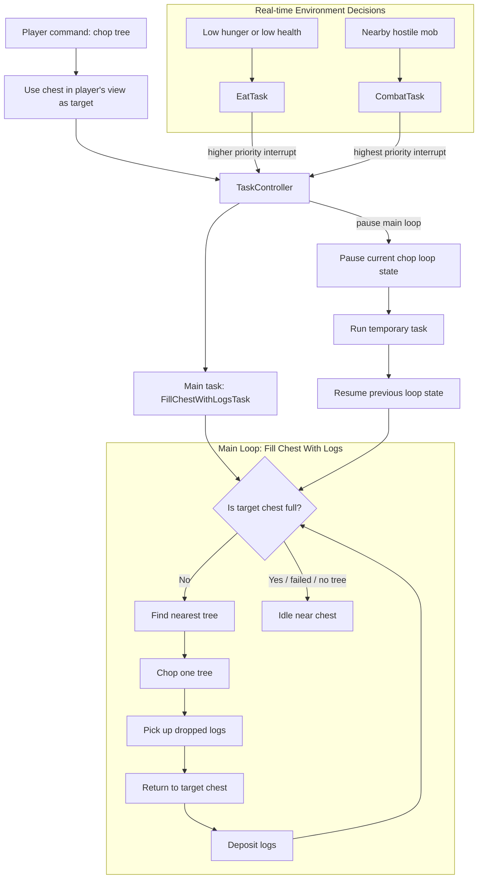

# MC Agent

A Mineflayer-based Minecraft bot that can chop trees into a player-selected chest, collect dropped logs, follow the player, eat when needed, fight nearby hostile mobs, and repair invalid movement state caused by server/client physics glitches.

[Demo video](https://youtu.be/mFIOwD34vzo)

## System Design Diagram



## How It Is Designed

The bot is designed around a small task controller. Player commands and world events are converted into tasks, and `TaskController` decides which task should run based on priority.

The main task is `FillChestWithLogsTask`, which handles the full chop-tree loop: check the target chest, find a tree, chop one tree, pick up dropped logs, return to the chest, deposit logs, and repeat.

Real-time environment changes can interrupt that loop. If the bot is hungry or low on health, it runs `EatTask`. If a hostile mob is nearby, it runs `CombatTask`. These temporary tasks have higher priority, so the controller pauses the chop-tree loop, runs the urgent task, then resumes the previous loop state.

Each task implements the same basic lifecycle: `start`, `pause`, `resume`, `cancel`, and `getState`. This keeps long-running behavior stateful and makes it possible to recover after interruptions.

| Task | Priority | Purpose |
| --- | ---: | --- |
| `CombatTask` | 200 | Fight nearby hostile mobs immediately. |
| `EatTask` | 100 | Eat when hunger or health drops below configured thresholds. |
| `ChopTreeTask` | 50 | Chop one tree using BFS-discovered log blocks. |
| `FillChestWithLogsTask` | 40 | Repeatedly chop trees, pick up drops, return to chest, and deposit logs. |
| `FollowPlayerTask` | 30 | Follow the player until replaced by another main task. |

## Chat Commands

| Command | Behavior |
| --- | --- |
| `find tree` | Finds and logs the nearest connected tree blocks. |
| `chop tree` | Uses the chest the player is looking at as the log deposit target, then starts the chop/deposit loop. |
| `follow me` | Cancels the chop/deposit loop and follows the player until another main command replaces it. |

For `chop tree`, the player must be looking directly at a chest or trapped chest.

## Reproduction Instructions

### 1. Install dependencies

```bash
npm install
```

### 2. Start a Minecraft server

Run a Java Minecraft server locally on:

```text
host: localhost
port: 25565
```

The bot username is hardcoded as `Bot` in `src/bot.ts`.

For local testing, make sure the server allows the bot to join. Depending on your server setup, you may need to allow offline/local players.

### 3. Start the bot

Run the bot with the viewer:

```bash
npm run dev:viewer
```

The Prismarine viewer starts at:

```text
http://localhost:3007
```

To run without the viewer, use:

```bash
npx tsx src/main.ts
```

### 4. Prepare the world

1. Join the same server as a player.
2. Place a chest near the bot.
3. Put an axe and food, such as bread, in the bot inventory.
4. Make sure trees exist within search range.

### 5. Reproduce the chop-and-deposit loop

1. Look directly at the chest.
2. Type this in Minecraft chat:

```text
chop tree
```

Expected behavior:

1. Bot records the chest as the deposit target.
2. Bot finds and chops one nearby tree.
3. Bot picks up dropped log items from the ground.
4. Bot returns to the chest.
5. Bot deposits logs.
6. Bot repeats until the chest is full or no tree can be chopped.

### 6. Reproduce follow replacement

While the bot is chopping, type:

```text
follow me
```

Expected behavior:

1. Current chop/deposit loop is cancelled.
2. Stored chest target is cleared with the cancelled task.
3. Bot follows the player.
4. Typing `chop tree` again while looking at a chest replaces following with the chop/deposit loop.

### 7. Reproduce combat interruption

Spawn or approach a hostile mob near the bot.

Expected behavior:

1. `CombatTask` interrupts the current lower-priority task.
2. Bot fights the hostile mob.
3. When combat finishes, the interrupted task resumes if it was paused by the controller.

### 8. Reproduce eating interruption

Damage the bot or reduce hunger while it has food in inventory.

Expected behavior:

1. `EatTask` is requested when health or hunger falls below the configured threshold.
2. Bot pauses lower-priority work if needed.
3. Bot eats, then previous work resumes.
